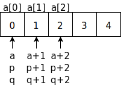
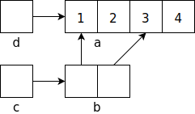

# Pointers and Arrays

## Introduction

- Pointers are variables that store memory addresses

- They store the address of a memory region that stores a particular type of data

- The size of a pointer is determined by the address size of the CPU

  ```c
  int* p;
  int i = 10;
  p = &i;
  ```

  

## Pointer declaration

- A pointer is declared using the `*` operator

  ```c
  int* p;
  ```

- `*` is called the dereferencing operator because `*p` returns the value of the value `p` points to

- The `&` operator is used to recover the memory address of a variable; it cannot be applied to expressions, constants, or register variables

  ```c
  p = &i;
  ```

## Pointer assignment and usage

- Pointers of the same type can be assigned to one another

  ```c
  int i = 10;
  int* ip = &i;
  int* iq = ip; // iq now points to i
  ```

- Operator precedence in usage of `*` operator

  ```c
  *ip += 1;
  ++*ip;
  (*ip)++;
  ```

  - increment value pointed to by `ip`

  - `*ip++;` would be incorrect; why?

## Function arguments

- Arguments are passed to a function by value, even pointer arguments

- Pointers provide a mechanism for functions to alter the value of referenced variables

- Exercise: write a function that swaps the value of its arguments

## Arrays

- Arrays provide contiguous storage to multiple elements of the same type

  ```c
  int a[10]; // declares an array of 10 integers
  ```

- Elements of arrays declared as `extern`, `static` and `auto` are initialized to zero

- The array index starts at zero

  

## Array initialization

- Arrays can be initialized during declaration

  ```c
  int days[] = {5, 10, 15, 25, 30};
  ```

  - compiler fills in the size and fills the array

  ```c
  char name[] = "name";
  ```

  - right-hand side is a string constant

  ```c
  char name[] = {'n', 'a', 'm', 'e'};
  ```

- Arrays can be initialized using assignment statements or using loops

  ```c
  int days[5];
  days[0] = 5;
  ```

## Pointers vs Arrays

- Arrays and pointers are related

  ```c
  int a[5] = {0 , 1, 2, 3, 4};
  int* p = &a[0];
  int* q = a;
  ```

  - `a` always points to the start of the array and cannot be changed

  

## Pointer operations

- Pointers can be incremented in integer steps

- `p++` points to the next element

  - what does `*p++ = 10` do? (hint – see operator precedence table)

- `p--` points to the previous element

  - what does `*--p = 10` do? (hint – see operator precedence table)

- `p+=i` points to `i` elements beyond the current position

- `p-=i` points to `i` elements before the current position

- `p = 0` or `p = NULL` makes p a null pointer; a valid pointer that does not point to anything in particular

## Strings

- Strings constants are arrays of `char`

  ```c
  char name [] = "name";
  ```

- Since an array of `char` can be assigned to a pointer to `char`, a pointer to `char` can refer to a string constant

  ```c
  char* name = "name";
  ```

- `strlen(s)` can be used to calculate length of a string

  ```c
  strlen(name) returns 4
  ```

- A string is internally padded with NULL character or `'\0'`; `name` is thus internally 5 characters long

- Exercise: write a function to replace `strcpy`

## Multi-dimensional Arrays

- Declaration

  ```c
  int a[10][20];
  ```

  - 10 rows and 20 columns, *contiguous* storage for 200 integers

- Initialization

  ```c
  int a[][2] = { {1,2}, {3} };
  int (b[])[2] = { {1,2}, {3} };
  ```

  - The number of columns (length of each row) needs to be known beforehand; try printing `a[1][1]`, what do you get?

## Array of Pointers

- This is how you would construct an array of string constants

  ```c
  char a[][7] = {"hello", "world!"};
  printf("%s %s\n", a[0], a[1]);
  ```

  

- The multi-dimensional array above may be substituted by an array of pointers to char

  ```c
  char* a[] = {"hello", "world!"};
  printf("%s %s\n", a[0], a[1]);
  ```

  

## Pointers vs Multi-dimensional Arrays

- Multi-dimensional arrays can be assigned to pointers

  ```c
  int a[2][2] = { {1,2}, {3,4} };
  int *b[2], **c, *d;
  b[0] = a[0]; b[1] = a[1];
  c = b; d = (int *)a;
  printf("%d\n", a[1][1]);
  printf("%d\n", *(*(a + 1) + 1));
  printf("%d\n", b[1][1]);
  printf("%d\n", *(*(b + 1) + 1));
  printf("%d\n", c[1][1]);
  printf("%d\n", *(*(c + 1) + 1));
  printf("%d\n", d[3]);
  printf("%d\n", *(d + 3));
  ```

  

## Command line arguments

- `main` function syntax

  ```c
  main (int argc, char * argv[])
  ```

  - `argc` is the number of arguments in the command-line that invoked the program
    - always at least `1` because the program name is itself an argument

  - `argv` is an array of pointers to `char`, each element points to a string

  - `argv[argc]` required to be a `NULL` pointer

  

## Pointers to Functions

- Pointers can point to functions

- Functions are very different from variables, but have an address where they start

- Declare a pointer to a function

  ```c
  int (*p)(int* a, int* b)
  ```

- Assign a function

  ```c
  p = add;
  ```

- Call the function

  ```c
  int a = b = 2;
  (*p)(&a, &b);
  ```

## void pointer

- Any pointer type can be assigned to, or passed to a function as, a void pointer

  ```c
  int* ip;
  void* vp = ip;
  ```

- void pointer can be cast to any pointer type

  ```c
  char* cp = (char*) vp;
  ```

- Useful for making generic functions that apply to various types

- Be careful when casting `void*` to another type; know what you are doing

## Dynamic memory allocation

- Pointers not yet initialized are dangerous if they are not NULL pointers

- Pointers can be initialized to point to storage dynamically allocated using `malloc` or `calloc`

- `free` must be used to release the allocated memory

## malloc

- Allocates `n` bytes of storage and returns a void pointer to it

  ```c
  void* malloc(size_t n)
  ```

- Example

  ```c
  int* ip = (int*)malloc(10 * sizeof(int));
  free(ip);
  ```

  - `sizeof` _operator_ returns the size of the object or type specified

## calloc

- Allocates memory for `n` objects of size `size` and returns a void pointer to it

  ```c
  void* calloc(size_t n, size_t size)
  ```

- The memory assigned is initialized to zeros

- Example

  ```c
  int* ip = (int*)calloc(10, sizeof(int));
  free(ip);
  ```

## Memory allocation problems

- Using an uninitialized pointer

- Writing to memory outside the allocated region (buffer overflow)

- Freeing memory not allocated using malloc or calloc

- Not freeing memory allocated using malloc and calloc (memory leak)

## Using memwatch

- [memwatch](http://www.linkdata.se/sourcecode/memwatch/) is distributed as a single source file `memwatch.c` and its accompanying header file `memwatch.h`

- Source files you want to watch for memory problems must include `memwatch.h` and be recompiled using the following compiler options

  ```text
  -DMEMWATCH -DMW_STDIO
  ```

- memwatch prints an error message in the standard output and produces a detailed log file listing the memory problems it encounters

## Exercise

- Write a program that sorts an array of strings. Use your favorite sorting algorithm (bubble sort, insertion sort, etc). Write your own replacement for `strcmp` to compare the strings. Write a generic sort function that can work with arrays of other types
